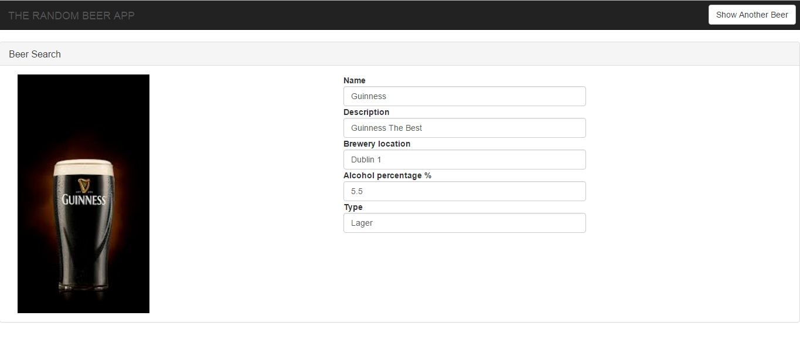

# The Random Beer App

Simple web app that displays details about a random beer

## Backend

Before you can build this project, you must install and configure the following dependencies on your machine:
1. [Java 8]: I used Java8 to develop the backend.
2. Internet Connection

You will only need to run this command (from backend folder) to start the backend.

    mvnw spring-boot:run
	
	
##### Linux User In backend folder change the permission of maven wrapper 

	chmod +777 mvnw
	
Then run with the backend with this command.

    ./mvnw spring-boot:run

##### Running from IDE
If you want start the backend from your IDE you can import the backend folder and just run the main class.

    RandomBeerAppApiApplication.java

## Frontend

To test the frontend just open the file above in your browser.

    /frontend/index.html

